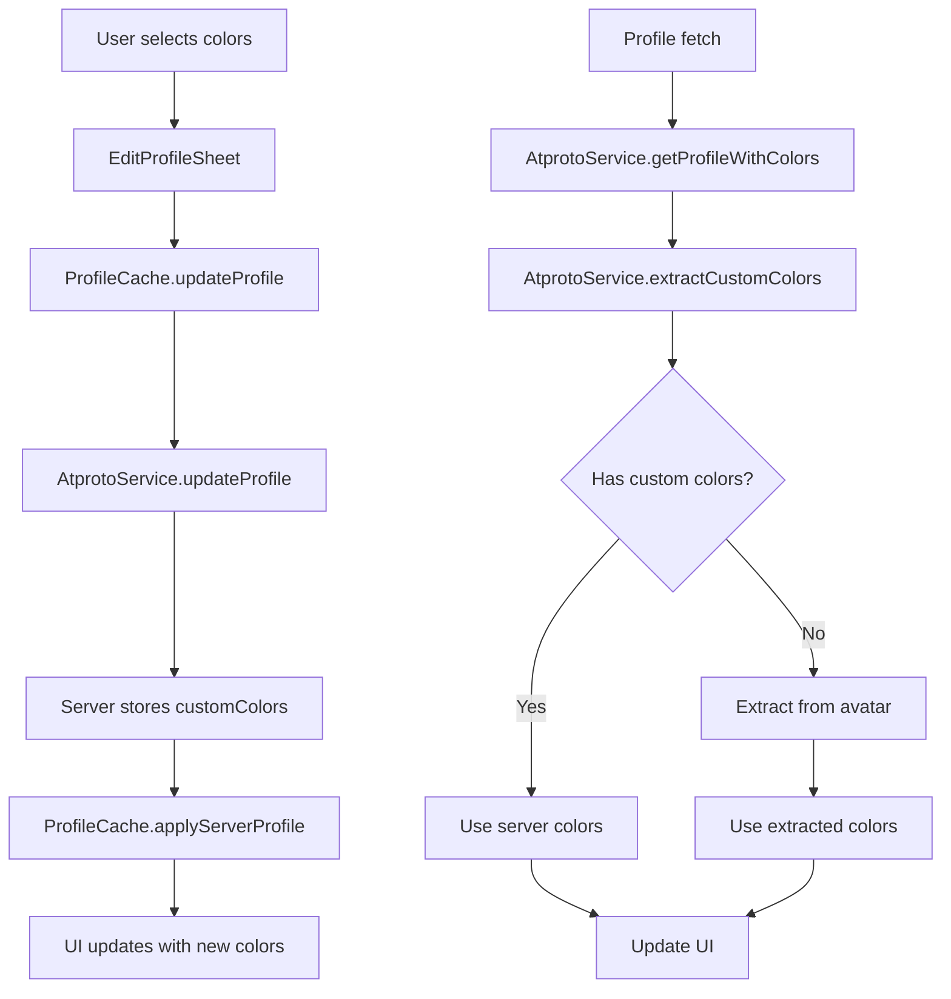

# Custom Profile Colors Implementation

## Overview

This document describes the implementation of custom profile colors in Orbyt using the AT Protocol's extensibility features. The system allows users to set custom background and text colors for their profiles, which are stored server-side and synced across devices.

## Architecture

### 1. Custom Schema Extension

The implementation uses a custom lexicon schema under the `com.orbyt.app` domain to extend the standard profile record with custom color fields.

**Schema Definition** (`src/services/api/CustomSchemas.ts`):
```typescript
export const CUSTOM_PROFILE_SCHEMA = {
  lexicon: 1,
  id: 'com.orbyt.app/profile',
  defs: {
    main: {
      type: 'record',
      record: {
        type: 'object',
        properties: {
          displayName: { type: 'string', maxLength: 64 },
          description: { type: 'string', maxLength: 256 },
          avatar: { type: 'blob' },
          customColors: {
            type: 'object',
            properties: {
              backgroundColor: { type: 'string', pattern: '^#[0-9A-Fa-f]{6}$' },
              textColor: { type: 'string', pattern: '^#[0-9A-Fa-f]{6}$' }
            },
            required: ['backgroundColor', 'textColor']
          }
        }
      }
    }
  }
};
```

### 2. Server-Side Integration

**AtprotoService Updates** (`src/services/api/AtprotoService.tsx`):

- `updateProfile()` - Now handles custom color fields in profile updates
- `getProfileWithColors()` - Fetches profiles with custom color support
- `extractCustomColors()` - Extracts and validates custom colors from profile data
- `checkCustomColorsSupport()` - Checks if the server supports custom colors

### 3. Client-Side Caching

**ProfileCache Updates** (`src/services/cache/ProfileCache.ts`):

- Prioritizes server-side custom colors over avatar-extracted colors
- Falls back to avatar color extraction for clients without custom color support
- Maintains local cache for immediate UI updates
- Handles graceful degradation when custom colors aren't available

### 4. User Interface

**EditProfileSheet Updates** (`src/components/features/profile/EditProfileSheet.tsx`):

- Color picker is now enabled (was previously hidden)
- 20+ predefined color options with proper contrast ratios
- Real-time preview of selected colors
- Server-side persistence of color choices

## Implementation Details

### Color Priority System

1. **Server Custom Colors** (Highest Priority)
   - Colors set by user via the color picker
   - Stored in the profile record under `customColors`
   - Synced across all devices

2. **Avatar Color Extraction** (Fallback)
   - Automatic color extraction from profile avatar
   - Used when no custom colors are set
   - Provides consistent theming based on user's avatar

3. **Default Colors** (Final Fallback)
   - Black background with white text
   - Used when no avatar or custom colors are available

### Data Flow



### Error Handling

1. **Invalid Color Format**
   - Validates hex color format (`#RRGGBB`)
   - Skips invalid colors with console warnings
   - Falls back to default colors

2. **Server Compatibility**
   - Checks if server supports custom colors
   - Graceful degradation for older servers
   - Maintains backward compatibility

3. **Network Errors**
   - Retries failed requests
   - Caches colors locally for offline use
   - Shows user-friendly error messages

## Usage Examples

### Setting Custom Colors

```typescript
import { useProfileUpdateMutation } from '../services/cache/ProfileCache';

const MyComponent = () => {
  const profileUpdateMutation = useProfileUpdateMutation();
  
  const handleColorChange = async (colors: { backgroundColor: string; textColor: string }) => {
    await profileUpdateMutation.mutateAsync({
      handle: 'user.bsky.social',
      updates: {
        customColors: colors
      }
    });
  };
};
```

### Reading Custom Colors

```typescript
import { useProfileColors } from '../services/cache/ProfileCache';

const MyComponent = () => {
  const { colors } = useProfileColors('user.bsky.social');
  
  return (
    <View style={{ backgroundColor: colors.backgroundColor }}>
      <Text style={{ color: colors.textColor }}>
        Profile content
      </Text>
    </View>
  );
};
```

### Checking Server Support

```typescript
import AtprotoService from '../services/api/AtprotoService';

const checkSupport = async () => {
  const isSupported = await AtprotoService.checkCustomColorsSupport();
  console.log('Custom colors supported:', isSupported);
};
```

## Migration Strategy

### For Existing Users

1. **Automatic Migration**: Existing users' colors are preserved in local cache
2. **Server Sync**: Colors are uploaded to server on next profile update
3. **No Data Loss**: All existing color preferences are maintained

### For New Users

1. **Default Colors**: New users start with avatar-extracted colors
2. **Color Picker**: Full access to 20+ predefined color options
3. **Server Storage**: Colors are immediately synced to server

## Performance Considerations

### Caching Strategy

- **Memory Cache**: Colors cached in memory for instant access
- **Persistent Storage**: Colors stored locally for offline use
- **Server Sync**: Colors synced to server for cross-device consistency

### Network Optimization

- **Batch Updates**: Multiple color changes batched together
- **Optimistic Updates**: UI updates immediately, server sync in background
- **Error Recovery**: Failed updates retried automatically

### Memory Management

- **Cache Limits**: Profile cache limited to prevent memory bloat
- **LRU Eviction**: Least recently used profiles evicted first
- **Background Processing**: Color extraction happens in background

## Security Considerations

### Color Validation

- **Format Validation**: Only valid hex colors accepted
- **Length Limits**: Color strings limited to 7 characters (#RRGGBB)
- **Pattern Matching**: Regex validation for color format

### Server Security

- **Schema Validation**: Server validates custom color schema
- **Rate Limiting**: Color updates rate limited to prevent abuse
- **User Authentication**: Only authenticated users can set colors

## Future Enhancements

### Planned Features

1. **Color Palettes**: Predefined color palette themes
2. **Gradient Support**: Background gradients for profiles
3. **Color Accessibility**: Automatic contrast ratio validation
4. **Color History**: Track and restore previous color choices

### API Extensions

1. **Bulk Color Updates**: Update multiple profiles at once
2. **Color Sharing**: Share color schemes between users
3. **Color Analytics**: Track popular color combinations
4. **Color Recommendations**: AI-powered color suggestions

## Troubleshooting

### Common Issues

1. **Colors Not Saving**
   - Check network connection
   - Verify user authentication
   - Check console for error messages

2. **Colors Not Loading**
   - Clear app cache
   - Restart the application
   - Check server connectivity

3. **Invalid Color Format**
   - Ensure colors are in hex format (#RRGGBB)
   - Check for typos in color values
   - Use color picker for valid colors

### Debug Mode

Enable debug logging by checking console output:

```typescript
// Check if custom colors are supported
const isSupported = await AtprotoService.checkCustomColorsSupport();
console.log('Custom colors supported:', isSupported);

// Check current profile colors
const profile = await AtprotoService.getProfileWithColors('user.bsky.social');
const colors = AtprotoService.extractCustomColors(profile);
console.log('Profile colors:', colors);
```

## Testing

### Manual Testing

1. **Color Selection**: Test all 20+ predefined colors
2. **Server Sync**: Verify colors sync across devices
3. **Fallback Behavior**: Test with and without custom color support
4. **Error Handling**: Test with invalid color formats

### Automated Testing

```typescript
// Test color validation
const validColors = { backgroundColor: '#FF0000', textColor: '#FFFFFF' };
const invalidColors = { backgroundColor: 'red', textColor: 'white' };

// Test server support
const isSupported = await AtprotoService.checkCustomColorsSupport();
expect(isSupported).toBe(true);

// Test color extraction
const colors = AtprotoService.extractCustomColors(profile);
expect(colors).toEqual(validColors);
```

## Conclusion

The custom profile colors implementation provides a robust, scalable solution for user personalization while maintaining compatibility with the AT Protocol and existing Bluesky infrastructure. The system gracefully handles various edge cases and provides a smooth user experience across all supported platforms.
